# Hive Resurgence

 > [Click here to view the live website on GitHub Pages]() Please note: To open any links in this document in a new browser tab, please press `Cmd ⌘ + Click` (Mac) or `CTRL + Click` (Windows/Linux)

## **Introduction**

Hive Resurgence is a site all about raising awareness around the bee crisis here in the UK, alongside some lighthearted fun facts. The site is targeted towards people with an interest in local and global crisis awareness mainly towards bees. Hive Resurgence will be useful as a reference for those seeking information around the current UK bee crisis.

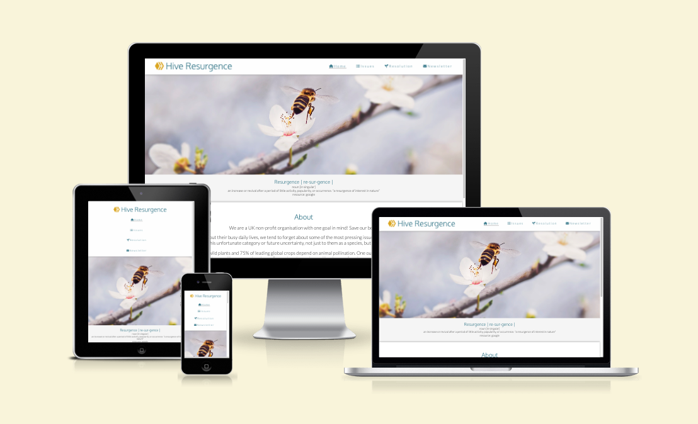

## **Color Palette**

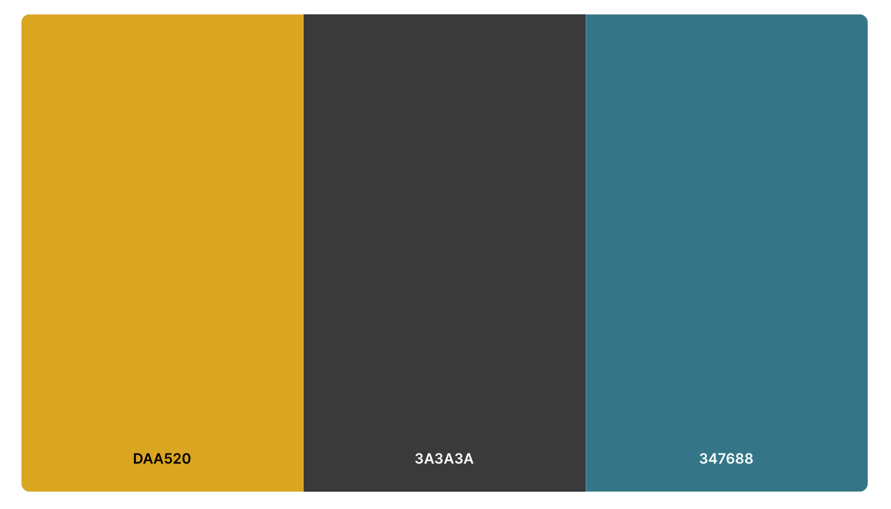

`#daa520` Used for font awesome logo in the header, highlighted text and buttons throughout when `:hover` and social network icons in the footer when `:hover`.

`#3a3a3a` Used for all `body` text and font awesome social media icons before `:hover`.

`#347688` Used for all `h1` and `h2` elements, various buttons throughout and navbar page links before `:hover`.

## **Common Features**

### Navigation Bar

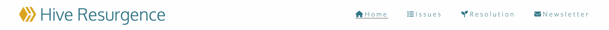

- The navigation bar features a consistent design across all four pages keeping with convention with a logo on the left hand side and the navigation links to the right when the screen width is above 1200px wide to allow for easy of navigation.

- This section will allow the user to easily navigate from page to page across all devices without having to revert back to the previous page via the ‘back’ button.

- The navigation bar sticks to the top of the web page regardless if you scroll down. This is achieved by using the `position: sticky;` declaration, accompanied by the `top: 0;` and `z-index: 1;` declarations to specify where to stick to, and to come on top over any `position: absolute;` items.

- The logo has a link to the home page `index.html` when clicked on to allow the user to navigate back to the home page no matter where they're at on the website.

- The navigation bar is fully responsive; for smaller screens (500px down), the format of the bar changes to a column orientation with the logo at the top centered on the page and the title links vertically aligned underneath. For tablets and screens in between (800px down), there is a staggered change through the use of media queries in order to maximise its size.

- All features of animation the navigation bar includes are highlighted `#daa520` text and an increase in text scale size (zoom) when you hovering over the navigation list items.

### Footer

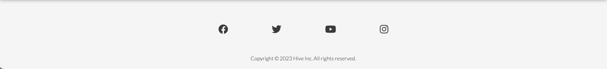

- The footer features an array of socila network icons from awesome font; each icon has the same highlighted `#daa520` text animation as the navigation links, when you hover over them. The social network icons, when clicked, take you to the corresponding social platforms in a new tab.

- The footer is valuable to the user as it encourages them to keep connected via social media. 

## **Home Features**

### Hero Image

- The home page includes a photograph of a bee hovering above a white blossom with a predominantly white and light background matching the clean white look of the website.

### Resurgence Definition Section

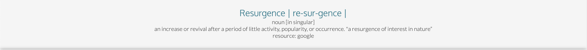

- I have used the definition of the word resurgence to give the user an understanding of the meaning and why its important to the brand.

### About Section

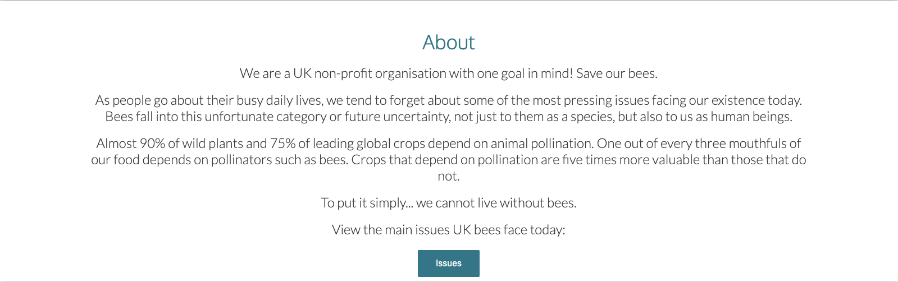

- The about section is here to help the user understand the target of the website and the aims we want to achieve. Its placed at the forefront of the website to provide the user with a brief summary of the overall informing projectives.

- The Issues button is located at the end of the text to give the user the option to jump straight into the Issues section of the website and is place here for ease and convenience. The button also highlighted `#daa520` when you hover over it. 

## **Issues Page Features**

### Content Section and Breaks

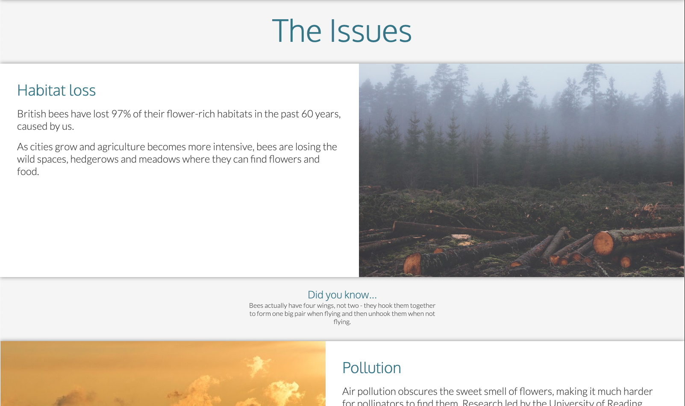

- The [Issues](issues.html) page is made up of different segments as identified by the comments in the [Issues](issues.html) file.

- Following the same layout as the [Home](index.html) file, the [Issues](issues.html) file uses the same coloring, stylings and section design.

- The `Breaks` as identified by the comments in the [Issues](issues.html) file are plainly seperators with `Did you know...` facts about bees relative to the website subject.

- Each section of the Issues page is divided equily with their own sub-topic of awareness.

## **Resolution Page Features**

### Content Sections and Breaks

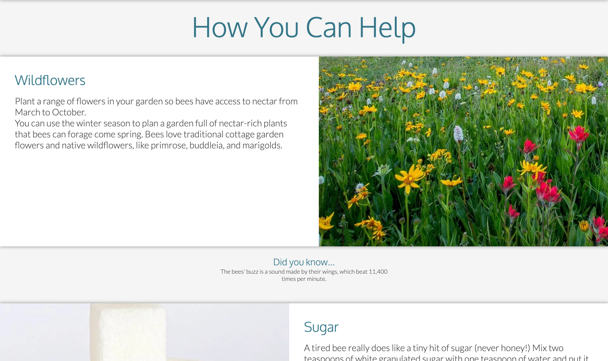

- The [Resolution](resolution.html) page follows the same layout, stylings and rules as the [Issues](issues.html) file.

- The `Breaks` inbetween the informative sections as also `Did you know...` facts about bees relative to the website subject.

### Know Your Bees Section

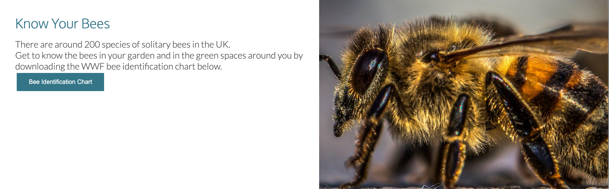

- This section has a `<button>` with the value [Bee Identification Chart](https://www.wwf.org.uk/sites/default/files/2020-05/Bee%20ID_2.pdf) linking it to an external web PDF file taken from [WWF](https://support.wwf.org.uk/) website.

### Charity Section

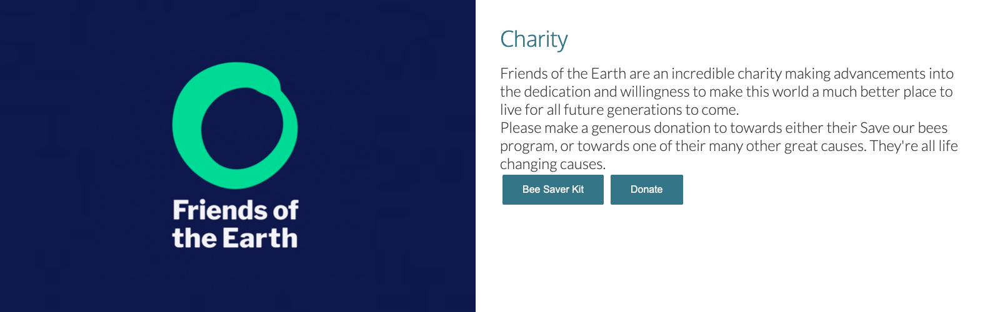

- Text

## **Newsletter Sign-Up Page Features**

### Sign-Up Page

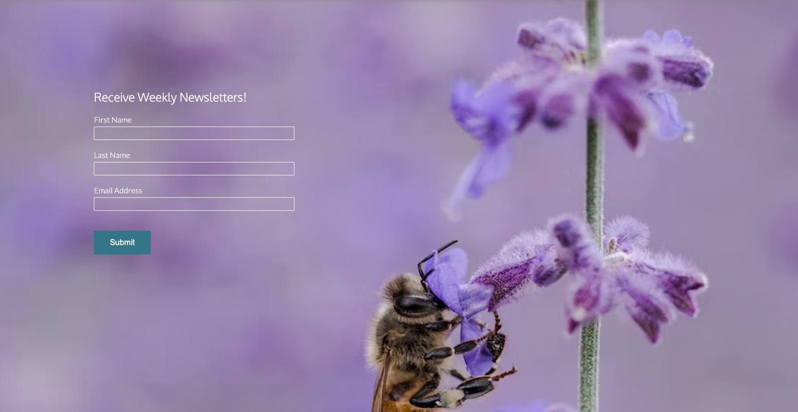

- Text

## **Hidden Page**

### Newsletter Sign-Up Confirmation Page

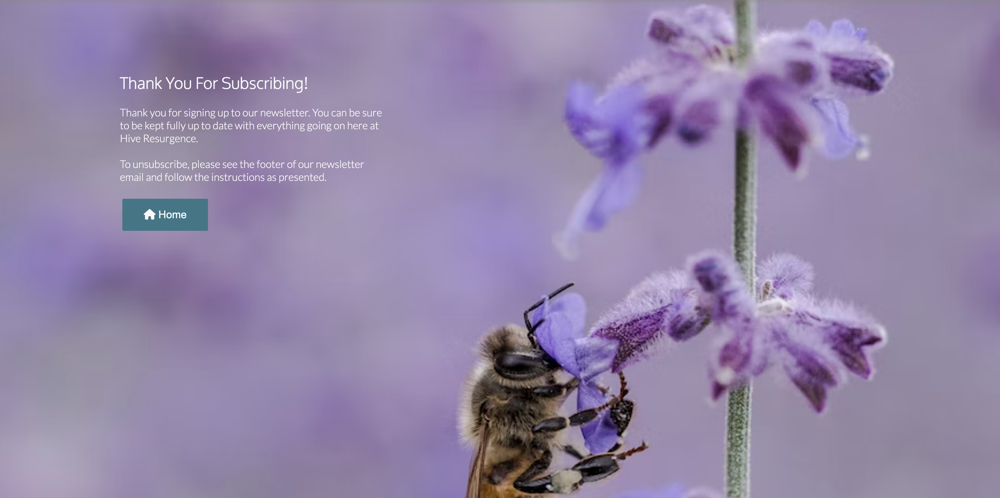

- Text

## **Validator Testing**

### [W3C Markup Validator](https://validator.w3.org/#validate_by_input)

- [Home page](index.html)
    - **Error:** The element `<button>` must not appear as a descendant of the `<a>` element.
        - I decided not to fix this as it didn't seem to be an issue and the button worked as intended.
    - **Info:** Trailing slash on void elements has no effect and inteeracts badly unquoted attribute values.
        - I removed the the `/` on line 102.
- [Issues page](issues.html)
    - **Warning:** x7 Consider using the `h1` element as a top-level heading only (all `h1` elements are treated as top-level headings by many screen readers and other tools).
        - I decided to leave the `h1` elements as they are.
    - **Error:** End tag `` seen, but were open elements.
        - I swapped the two closing tags (`` and `</i>`).
        - This created 2x other **Error:** messages: Unclosed element `<i>` & No `<i>` element in scope but a `<i>` end tag seen. This was fixed when the `` and `<i>` was swapped around.
- [Resolution page](resolution.html)
    - **Error:** x3 The element `<button>` must not appear as a descendant of the `<a>` element.
        - I decided not to fix this as it didn't seem to be an issue and the button worked as intended.
    - **Warning:** x7 Consider using the `h1` element as a top-level heading only (all `h1` elements are treated as top-level headings by many screen readers and other tools).
        - I decided to leave the `h1` elements as they are.
- [Newsletter page](newsletter.html)
    - **Error:** Bad value `" "` for attribute `method` on element `<form>`.
        - I added the text `newsletter-confirmation.html` to the `method=" "` attribute.
- [Newsletter confirmation (hidden page)](newsletter-confirmation.html)
    - **Error:** The element `<button>` must not appear as a descendant of the `<a>` element.
        - I decided not to fix this as it didn't seem to be an issue and the button worked as intended.

### [W3C CSS Validatior](https://jigsaw.w3.org/css-validator/#validate_by_input)

- All pages tested, no issues found via file upload.

    

### Lighthouse

I generated a lighthouse report for the deployed site through the Google Chrome Dev Tools. I generated both a desktop and mobile report.

### Desktop Report

### Mobile Report

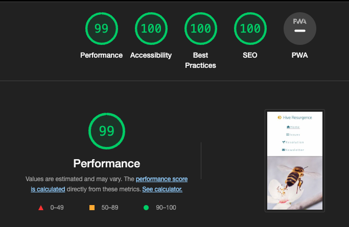

## **Deployment**

- The site was deployed to GitHub pages. the steps to deploy are as follows:
    - In the GitHub repository, navigate to the settings tab
    - Select the pages link from the setting menu on the left hand side
    - Under the GitHub Pages from the source section drop-down menu, select the main branch
    - Once the main branch has been selected, the page will be automatically refreshed with a detailed ribbon display the indicate the successful deployment

> [Click here to view the live website on GitHub Pages]() Please note: To open any links in this document in a new browser tab, please press `Cmd ⌘ + Click` (Mac) or `CTRL + Click` (Windows/Linux)

## **Bugs**

- **Bug #1**

    - **Issue:** I have a navbar with with `position: sticky;`. I have a div with `position: relative;` and a div nested inside that div with `position: absolute;`. When scrolling, the div with `position: relative;` puts itself above the navbar.

    - **Fix:** I added `z-index: 1;` to the header. I found the answer here: [Stack Overflow: Z-Index](https://stackoverflow.com/questions/66292396/is-it-possible-to-keep-relative-elements-below-a-sticky-navbar)

- **Bug #2**

    - **Issue:** The hero image didn't fit the div container on an ultra-wide monitor.

    - **Fix:** I added an `` tag to the `index.html` file instead of the background declaration that was initially assigned to the div in `style.css`. Targeting the `` tag with the `object-fit: cover;` property. I found the answer here: [W3Schools - Object-fit Property](https://www.w3schools.com/css/css3_object-fit.asp)

## **Credits**

### Content

- The icons used for the logo, bookmark links, and other various buttons throughout the website were taken from [Font Awesome](https://fontawesome.com/)

- The font used throughout the website was imported from [Google Fonts](https://fonts.google.com/)
    - Oxygen - Light 300
    - Lato - Light 300

- Websites that have helped with issues, research and fact finding:
    - [Stack Overflow](https://stackoverflow.com/)
    - [YouTube - Web Dev Simplified](https://www.youtube.com/@WebDevSimplified)
        - [Zoom Animation](https://www.youtube.com/watch?v=YszONjKpgg4) `class='zoom'` in Markup and `.zoom:hover` in CSS.
        - [Flexbox](https://www.youtube.com/watch?v=fYq5PXgSsbE) `display: flexbox;`
        - [Positioning](https://www.youtube.com/watch?v=jx5jmI0UlXU&t=335s) `position: absolute;` to the nested element and `position: relative;` to the parent element.
    - [W3Schools](https://www.w3schools.com/)
        - [Favicon](https://www.w3schools.com/html/html_favicon.asp) `<link rel="icon" type="image/x-icon" href="assets/images/html favicon logo/hive-resurgence-logo.png”>`
        - [Object-fit](https://www.w3schools.com/css/css3_object-fit.asp) `object-fit: cover;`
    - [HubSpot](https://blog.hubspot.com/)
        - [Fade-In Animation](https://blog.hubspot.com/website/css-fade-in) `class='fade-in'` in Markup and `animation: fadeIn 1s;` in CSS.
    - [WWF](https://support.wwf.org.uk/)
        - [Save UK Nature](https://support.wwf.org.uk/uk-nature)
    - [Friends of the Earth](https://friendsoftheearth.uk/)
        - [Save our bees](https://friendsoftheearth.uk/bees)

### Media

- For all the images used throughout the website, I collected the content from the following websites:
    - [PxHere](https://pxhere.com)
    - [Pexels](https://www.pexels.com)
    - [Unsplash](https://unsplash.com)
    - [Pixabay](https://pixabay.com)

<!-- FIN. -->