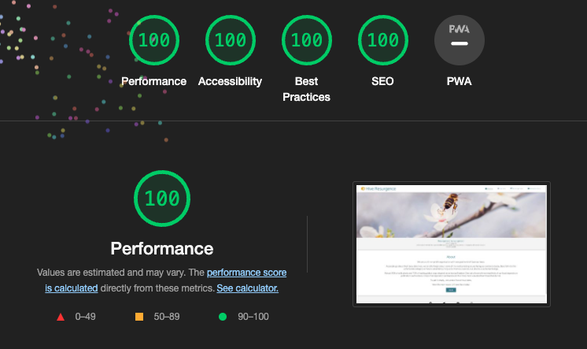

# Hive Resurgence

 > [Click here to view the live website on GitHub Pages]() Please note: To open any links in this document in a new browser tab, please press `Cmd ⌘ + Click` (Mac) or `CTRL + Click` (Windows/Linux)

## Introduction

Hive Resurgence is a site all about raising awareness around the bee crisis here in the UK, alongside some lighthearted fun facts. The site is targeted towards people with an interest in local and global crisis awareness mainly towards bees. Hive Resurgence will be useful as a reference for those seeking information around the current UK bee crisis.

## Features

### Common Features

### Navigation Bar

- The navigation bar features a consistent design across all four pages keeping with convention with a logo on the left hand side and the navigation links to the right when the screen width is above 1200px wide to allow for easy of navigation.

- This section will allow the user to easily navigate from page to page across all devices without having to revert back to the previous page via the ‘back’ button.

- The navigation bar sticks to the top of the web page regardless if you scroll down. This is achieved by using the `position: sticky;` declaration, accompanied by the `top: 0;` and `z-index: 1;` declarations to specify where to stick to, and to come on top over any `position: absolute;` items.

- The logo has a link to the home page `index.html` when clicked on to allow the user to navigate back to the home page no matter where they're at on the website.

- The navigation bar is fully responsive; for smaller screens (500px down), the format of the bar changes to a column orientation with the logo at the top centered on the page and the title links vertically aligned underneath. For tablets and screens in between (800px down), there is a staggered change through the use of media queries in order to maximise its size.

- All features of animation the navigation bar includes are highlighted `#daa520` text and an increase in text scale size (zoom) when you hovering over the navigation list items.

### Footer

- The footer features an array of socila network icons from awesome font; each icon has the same highlighted `#daa520` text animation as the navigation links, when you hover over them. The social network icons, when clicked, take you to the corresponding social platforms in a new tab.

- The footer is valuable to the user as it encourages them to keep connected via social media. 

### Home Page Features

### Hero Image

- Text

### Resurgence Definition Section

- Text

### About Section

- Text

### Issues Page Features

### Issues and Break Sections

- Text

### Resolution Page Features

### Resolution and Break Sections

- Text

### Know Your Bees Section

- Text

### Charity Section

- Text

### Newsletter Page Features

### Newsletter Sign-Up

- Text

### Newsletter Sign-Up Confirmation

- Text

## Validator Testing

### HTML

### CSS

### Lighthouse

### Desktop Report

### Mobile Report

